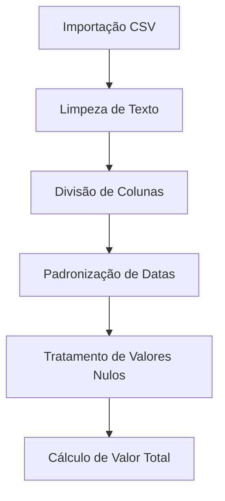
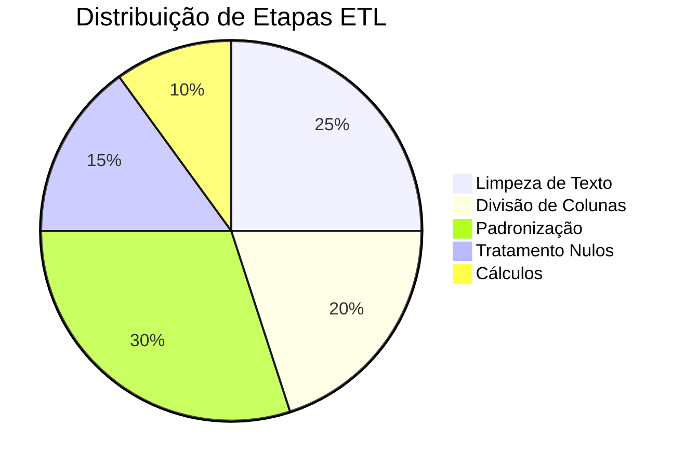

# 📊 Processo ETL - Limpeza de Dados de Vendas



## 1. Importação e Preparação Inicial

```powerquery-m
Fonte = Csv.Document(
    File.Contents("C:\Users\alanm\Desktop\Programação\Arquivos para leitura CSV\SalesData_Dirty.CSV"),
    [Delimiter=",", Columns=7, Encoding=1252, QuoteStyle=QuoteStyle.None]
),
#"Cabeçalhos Promovidos" = Table.PromoteHeaders(Fonte, [PromoteAllScalars=true])
```

**Objetivo**: Importar arquivo CSV e promover a primeira linha como cabeçalho.

## 2. Limpeza de Dados Textuais

```powerquery-m
#"Tipo Alterado" = Table.TransformColumns(#"Cabeçalhos Promovidos", {{"CustomerName", Text.Trim}}),
#"Texto Limpo" = Table.TransformColumns(#"Tipo Alterado", {{"CustomerName", Text.Clean, type text}})
```

**Ações realizadas**:
- Remoção de espaços extras com `Text.Trim`
- Limpeza de caracteres não imprimíveis com `Text.Clean`
- Conversão para tipo texto

## 3. Divisão de Colunas

```powerquery-m
#"Dividir Coluna por Delimitador" = Table.SplitColumn(
    #"Texto Limpo", 
    "Product_Code", 
    Splitter.SplitTextByEachDelimiter({"_"}, QuoteStyle.Csv, false), 
    {"Product_Code.1", "Product_Code.2"}
),
#"Colunas Renomeadas" = Table.RenameColumns(#"Tipo Alterado1", {
    {"Product_Code.1", "ProductID"}, 
    {"Product_Code.2", "ProductCode"}
})
```

**Melhoria sugerida**:
```powerquery-m
// Adicionar tratamento de erro caso a coluna não contenha "_"
= Table.SplitColumn(#"Texto Limpo", "Product_Code", 
    each if Text.Contains(_, "_") then Splitter.SplitTextByDelimiter("_")(_) else {_, null}, 
    {"ProductID", "ProductCode"})
```

## 4. Padronização de Datas

```powerquery-m
#"Personalização Adicionada" = Table.AddColumn(#"Colunas Reordenadas", "Personalizar", each 
    try Date.From(DateTime.From([OrderDate])) 
    otherwise try Date.FromText([OrderDate], "dd/MM/yyyy") 
    otherwise try Date.FromText([OrderDate], "dd-MM-yyyy") 
    otherwise try Date.FromText([OrderDate], "yyyy-MM-dd") 
    otherwise null)
```

**Alternativa mais limpa**:
```powerquery-m
= Table.TransformColumns(#"Colunas Reordenadas", {
    {"OrderDate", 
     each List.First(
         List.Transform(
             {"dd/MM/yyyy", "dd-MM-yyyy", "yyyy-MM-dd"},
             (format) => try Date.FromText(_, format) otherwise null
         )
     ), type date}
})
```

## 5. Tratamento de Valores Nulos

```powerquery-m
#"Valor Substituído" = Table.ReplaceValue(
    #"Colunas Renomeadas1",
    null, 1, Replacer.ReplaceValue, {"Quantity"}
),
#"Valor Substituído1" = Table.ReplaceValue(
    #"Colunas Reordenadas1",
    "", "Cliente sem Identificação", Replacer.ReplaceValue, {"CustomerName"}
)
```

## 6. Cálculo do Valor Total

```powerquery-m
#"Personalização Adicionada1" = Table.AddColumn(
    #"Tipo Alterado2", 
    "TotalValue", 
    each [Quantity]*[UnitPrice], 
    type number
)
```

## Diagrama do Fluxo Completo



## Melhorias Recomendadas

1. **Tratamento de erros robusto**:
   ```powerquery-m
   = Table.AddColumn(..., "DataPadronizada", each 
       try ... // sua lógica atual
       otherwise error "Formato de data inválido: " & Text.From([OrderDate])
   )
   ```

2. **Documentação inline**:
   ```powerquery-m
   // 2024-03-15 | Alan | Converte múltiplos formatos de data
   = Table.AddColumn(...)
   ```

3. **Funções reutilizáveis**:
   ```powerquery-m
   let
       fnPadronizaData = (input) => ... // sua lógica de data aqui
   in
       Table.AddColumn(..., "Data", each fnPadronizaData([OrderDate]))
   ```
